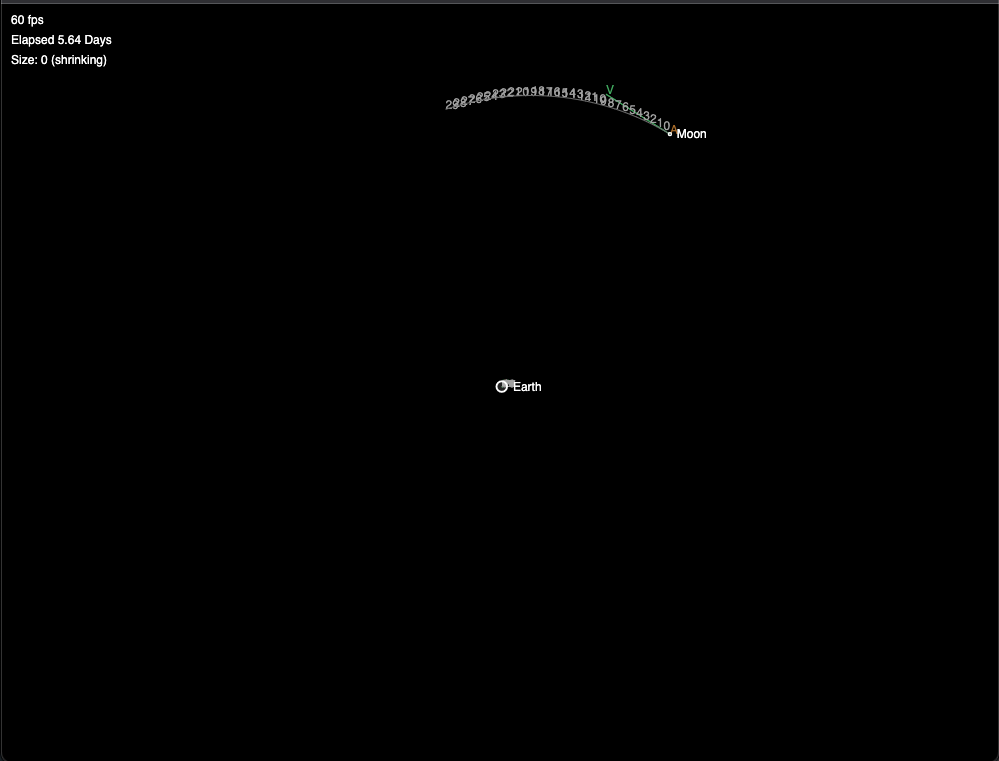
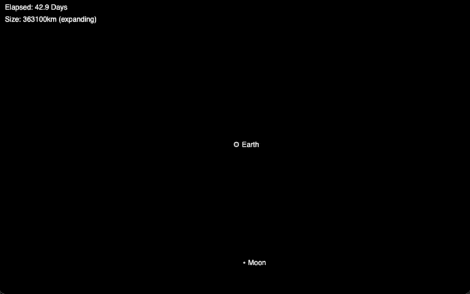

# Dev Blog #5

10/2 - 10/9 (2021)

## Physics is hard. Calculus is harder

This is what I'm looking at now.

The best I can tell currently is that different step values in both Newton's basic formula and the Runge-Kutta calculus approach has an outsized impact on the direction of the accuracy of the simulation.

Make dt too small, and the moon errs on the side of flying off into the abyss.

Make dt too large, and it errs on the side of collapsing, then catapaulting, off into the abyss.

The above is with a fixed dt of 0.09 days/step.

Ideally, we can get to a place where dt can be increased/decreased freely at any given point to speed up/slow down the simulation, but for now it's running at about 6 days/second, and the moon avoids catapaulting into the abyss for roughly 7.5 years (453 days on the first run, 758 days on the second).

The issues with dt are also what was causing path prediction to break down. The large dt (1.0 days) needed to predict 30 days into the future means that the paths are always being predicted too much in the collapse & catapault direction.

## Another possible game idea

My sister mentioned to me that if I could get the physics figured out it would be really cool to translate this into a game where a player is in a tiny boat on a big chaotic ocean, where there's waves and currents pushing them around & they have to stay afloat :)

## Goals for this week

1. Figure out the delta-time problem (maybe a softening constant isn't that crazy)
2. Scale up the sim to include Sun, Mercury, Venus, Earth + Moon
3. Use the differing scales/distances to help solve goal 1

Nice to Haves :)

4. Add some controls to speed up/slow down the sim, predict or not predict paths
5. Figure out a way to run path prediction less frequently, since it's an expensive operation
6. Maybe even add a basic player ship that both responds to keyboard controls, and is affected by the system gravity

If a softening constant is needed, or some other kind of rough error correction, I'd like to be able to explain why it is, what it does exactly. 

It would also be neat to figure out a solution to the catapaulting problem, like maybe look for instances where a vector crosses perpendicular to a planet and scale that one vector by the distance that it would pass the planet by. That might provide the braking force that would help correct for error in the highly elliptical orbits or very tight orbits, since that seems to be one of the main sources of error in the code version of Newton's math.

## Differential Equations

I've been digging into the YouTube series on Differential Equations by Three Blue One Brown and learning a lot more about how and why these kinds of approximations run into such dramatic error. The tighter the steps, the closer to accurate, and in my case, I'm probably under-setting the value of acceleration caused by force, because we would expect the moon's orbit to be much tighter and close to accurate at very small values of delta time.

A couple alternate approaches to gravity could be:

- use a tiny tiny value for dt, then run multiple steps per frame, which would be (maybe) close enough to accurate to create a stable orbit
- use a softening constant, either a constant one with a fixed dt, or one that scales inversely to dt. It would do a bad job when multiple planets got close, but might work for basic orbits 
- pre-compute the paths at a very small dt, then simply play back the fixed progression, assuming the system is determinate enough (Eg. Ships don't have the ability to move planets or anything). JPL already has the orbital positions of all the planets in three dimensions calculated for the next 8k years, so there's no need to even do the computations myself. 
- use one of the derivatives methods to get more accurate values when simulating in real time, which would be more computationally expensive but more accurate.

It seems like a trade off between real time performance and storage space.

The next test to put together is one that predicts paths for an arbitrary number of steps at an arbitrary dt, and then run that with a bunch of values of dt a bunch of times, and see the different paths drawn on the screen. Maybe there's something we can do here.

Also, a benefit to using the pre-baked data from JPL (or baking my own data), is that we could then scroll forwards & backwards in time, which would allow us to dial the speed faster or slower by looking at every other step, or every third step, or so on.

The benefit to pre-baking data myself is that I could keep it to 2D, where the JPL data is all in 3D. Also, it means I could pre-bake all kinds of systems myself that JPL doesn't have data for, including theoretical systems like one with very elliptical orbits, or binary stars, or time-dilating black holes :)

As a sidebar, it might be kind of cool to explore a vector field visualization.

- could be used to visualize the pull of gravity over the whole space
- could be used to play with waves of force pushing and pulling, where each vector propagates force to the vectors immediately around it (like that big chaotic ocean sim my sister mentioned last week)

## Object type idea

Wormholes!

A circle that transports a ship from one point to another on the map, which itself is moving around and orbiting other stuff

## Math is amazing

I dug into Forier series today via 3 Blue 1 Brown & learnedd about the approximation of complex functions by addingthe results of simpler ones (in Forier's case, Adding sin/cosine functions together to approximate any arbitrary function).

I'm not certain that Forier has any application in predicting the orbits of planets, but a critical insight of his from 200 years ago is that a true solution to the problem does exist, and it's possible that solution is attainable by wisely combining simpler solutions. At it's essence, it's problem-solving 101, using what we know to get to what we don't yet know, but it illustrates an exceptional deep truth about creation.

All the complexity in the universe originates from 180-something types of atoms, each with different properties, added together in infinite (or at least uncountable) quantity. Each of those atmoms is in turn made up of a few dozen fundamental particles. God saw fit to create an entire universe by adding together the simplest of things.

Which is why Math works. Math is the simplest of things, being added together to describe creation. It's the approximation of a function via sin waves, then assuming infiinite detail. The more our minds are blown by creation, the more we come to appreciate the creator.

## Another kind of kind of working

After digging into the Runge-Kutta RK4 method this week, which is a 4th-order numerical integration solution for differential eequations, I got to here

It still depends on a fixed delta-time, which is a mystery to me. Smaller dt's are supposed to be more accurate, but in our case, the smaller the dt, the more the orbiting objects fly off into nothingness.

I'm starting to think that taking the big tables of data that JPL has on offere isn't such a crazy idea. After all, if part of the purpose of this sim/game is to teach an AI to navigate real-world astro-nav cases with only approximation tools on hand, what better way than to plot the planets' positions using the real data, then have the AI learn how to compensate for error in the received telemetries?