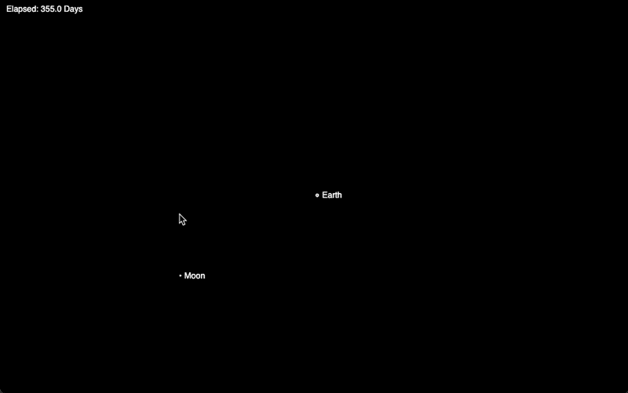
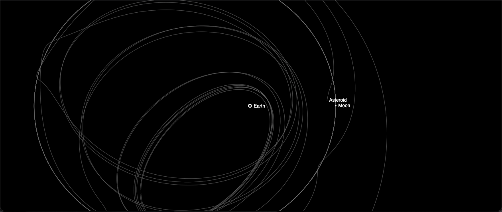
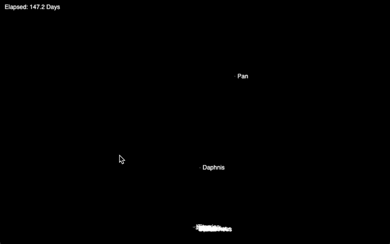

# Dev Blog #6

10/9 - 10/16 (2021)

## Goals for this week

Getting the whole solar system in a week might not be realistic, so let's start with something a little smaller. Also spending weeks on getting gravity right is starting to wear on me, so let's try to focus on an area that's a little different for a week and come back to gravity soon.

### Build a spaceship!

Some kind of basic player-controlled ship with the ability to thrust and change directions

### A Jovian moons level

Like a Saturn with a number of moons, maybe we can think about how to do rings.

### Maybe the start of an asteroid belt level 

That'd be cool. Like where the main source of gravity is wayyyy off screen, and asteroids are floating around the player's ship. Gravity essentially becomes a 1-directional force at that point, but that slowly changes direction as the map orbits the distant off-screen star.

This might be a great doorway to do some procedural generation or something.

## Neat visualizations

One of the perks of adding an asteroid is that we can see the different perspectives of orbits.

Per classic chaos-theory stuff, small changes in the initial inputs lead to beautifully different outputs :)

Now time to go work on Saturn :)

## Notes

Todo, maybe split the current `Planet` class into `Mass` (base class of some kind), `Planet`, `Asteroid`, and `Ship`

## Celestial Trojans

In researching Saturn I stumbled across [celestial trojans](https://en.wikipedia.org/wiki/Trojan_(celestial_body)), which is a group of asteroids (or theoretically planetoids) that fall into relatively stable orbits along the [Lagrange points](https://en.wikipedia.org/wiki/Lagrange_point) L4 and L5, sharing the orbit of the larger parent body. Apparently this is one of the ways that Jupiter collects asteroids and protects Earth.

From wikipedia:

These also make for a good test we can run to ensure gravity is working properly. Basically if gravity is working properly, Trojans should be able to settle into stable orbits along any of the L1-L5 points.

Basically, figure out the appropriate L1-L5 points for any body (say Earth or Jupiter), then place small masses there at whatever the theoretically correct velocities should be.

Then if gravity is working, those should orbit in a stable configuration like so:

Lagrage (the person) also left us with some great math, so I'll need to dig into that soon here too :)

Also to look into:

[Halo Orbit](https://en.wikipedia.org/wiki/Halo_orbit)
[Lissajous Orbit](https://en.wikipedia.org/wiki/Lissajous_orbit) - used in current space operations
[Horseshoe Orbit](https://en.wikipedia.org/wiki/Horseshoe_orbit)
[Interplanetary Transport Network](https://en.wikipedia.org/wiki/Interplanetary_Transport_Network)

First stab at a Saturn system, looks like I tied Titan to the focal point somehow :)

## Quick, distraction!

I took down a bunch of notes on playing audio based on the orbits, and discovered there's a [spacialization API for web sounds](https://developer.mozilla.org/en-US/docs/Web/API/Web_Audio_API/Web_audio_spatialization_basics) we can tap into!

This means that as planets move to one side of the screen or the other we "can move the audio around" with them.

There's also an [Oscillator Node](https://developer.mozilla.org/en-US/docs/Web/API/OscillatorNode) which allows us to play arbitrary waveforms.

Initial thoughts are that we could hook up an ON for each planet, then increase both it's frequency and volume (within reason) as it's total acceleration increases.

This means that a map with stable orbits, like Earth+Moon, would basically have a nearly-constant tone playing in the background
More likely we'd want to tie the gravity tones to ships as well, so that there's always a little auditory interest going on.

As an added bonus, several planets and moons have [orbital resonances](https://en.wikipedia.org/wiki/Orbital_resonance) with eachother, or very close to it (eg. a 2:1 or 4:1 ratio, where one orbit takes the same time as a certain number of orbits of another). This means we could get some legit rhythm going on in some levels

## Thoughts on Accessibility

There are a couple features that might be useful for folks to be able to configure:

- path contrast/colors
- audio on/off
- text size
- game speed

It might also be neat to be able to configure the background, or other aspects of the appearance, but we can figure that out more as we go.