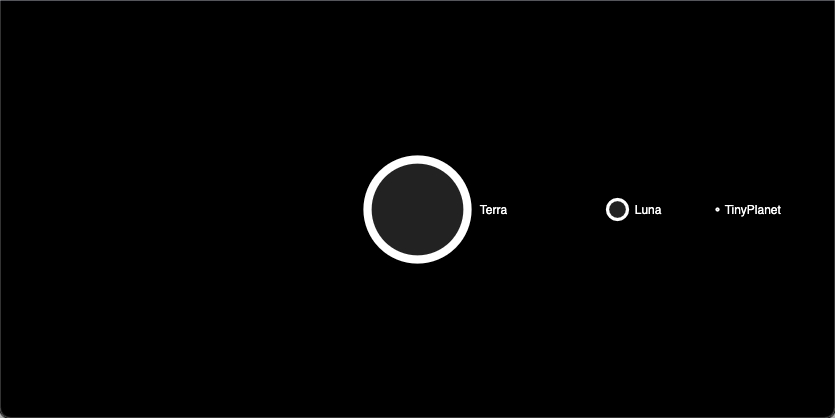
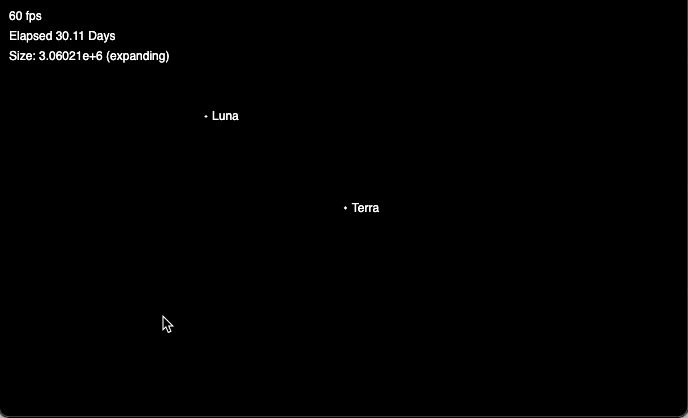
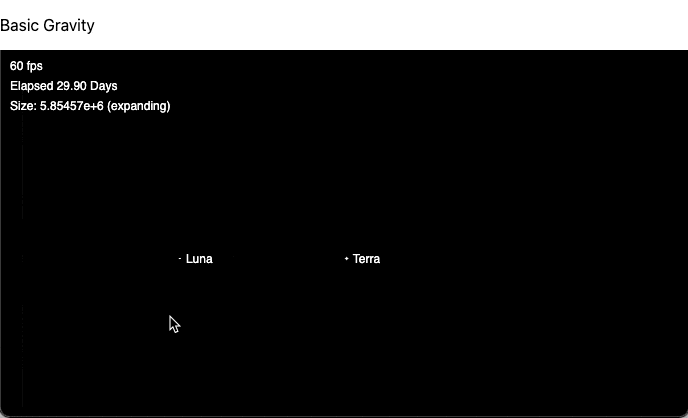
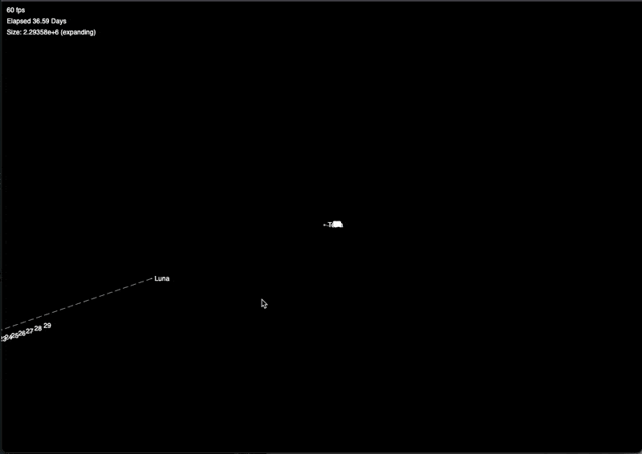
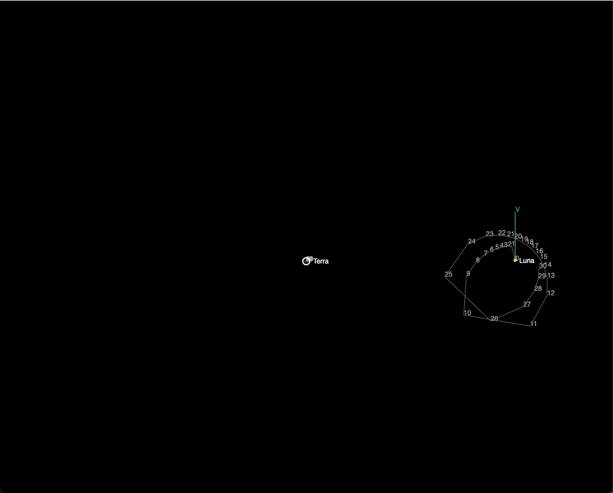
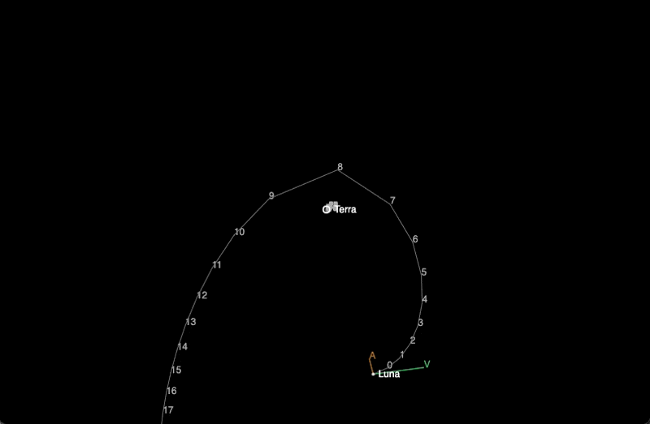

# Dev Blog #4

9/25 - 10/2 (2021)

## Thank the Lord for web technologies

24 hours in to working in js/canvas and it's like a breath of fresh air.

I didn't realize how frustrated I was getting with the Unreal Editor. I'm sure the engine itself is fine, but the editor took 5-10 minutes just to start up, contained 15 billion settings and shaders I didn't want (even with the most minimal setup), took up multiple gigs of ram to have open, and turned the laptop into a furnace.

Also it killed the fun of just coding for me. Blueprints are a neat way to visualize logic, but they (and most everything else about the Unreal Editing experience) were just too much of what I didn't want, and not enough of what I did.

There's such a tight loop now between what I'm coding, what I'm seeing on the screen, everything. It's smaller, more lightweight, simpler.

I'm probably just happy to be back in a space that I'm familiar with. I'm sure all the things that I want to do are totally possible in either straight C++ or Unreal or Unity, since none of it is really that complex (at least so far).

The best piece of advise I saw while comparing game engines to custom code was: "Use whatever framework you already know". There's cool stuff to be built, and the best tech stack is the one we can actually get stuff done in.

## Something to Show

Finally within Canvas we have some assets that actually make sense :)



And while gravity is still a work in progress, we at least have the start of a basic intro level with the Earth and Moon:



As an added bonus, Canvas & the web browser caps our sim to 60fps, and so far the simulation does very little work per frame, so performance is excellent.

## Goals for this week

1. Get Gravity right
2. Create a tests page (eg. moon/earth no velocities, moon/earth expected orbital path)
3. Generate the _expected_ position of each body for the next 30 adys
4. When we get to a circle for the moon and a much smaller circle for earth, then we can run motion and see if the predicted matches actual
5. Learn more orbital mechanics and math

See if JS already has a class baked in for vectors

Create a projection method, start with an array of positions with increasing time

Figure out real softening metric so that two bodies with no collisions should sort of spring around each other

Real play/pause

Componentize space to create multiple levels

Learn the math to be able to generate stable orbits

## Notes on (accurately) simulating gravity

With two large spherical bodies, gravity is slightly different from Newtonian point-masses. This was the problem I ran into early on in Unreal, where point masses can get infinitely close to eachother, which causes the force to approach infinity, taking acceleration, velocity, and position along with it, and in a single frame the smaller mass can accelerate too far away from the larger for the simulation to recover.

Some approaches use a [softening constant](https://css-tricks.com/creating-your-own-gravity-and-space-simulator/) which adds a fraction of the distance back in as the smaller body gets close.

TBD what the real math is to get it right.

Ideally we could reduce the pull of gravity from the center by some proportion of the two masses' radii, so that force approached zero as the masses started to intersect. In a theoretical world where the moon could slowly fall through the earth, it would hit a point where gravity was zero, as the earth would be evenly distributed on all sides around it.

Another challenge when simulating gravity is that the simulation runs the math at a series of fixed points in time, rather than smoothly over the course of the movement like a real gravitational body would. This means that a body can be at a position very close to another body at T=10.00, and the acceleration is great enough that by the next tick of the simulation T=10.0125 it's far away on the opposite side of the body.

In the real world, bodies would behave like a yoyo, where the outward acceleration as the body passed through another was exactly matched by the inward acceleraton on the other side. But because we have lmited points to work with, we run into simulation errors like this one:



Here you can see that the moon is caught by the earth's gravity roughly right the first time it passes through, but the second time a tick of the sim mismatched, and it was slung into the ayss.

Frame by Frame:

```text
On approach:
                     V Approaching very high acceleration
|------------------O-.--------.----.--.-.-|
                     5        4    3  2 1

After passing threshold:
    V Already moving too fast to be recovered
|---.--------------O----------------------|
    6
```

For frames 5 and 6 of the sim, the acceleration applied by gravity is calculated dramatically wrong

In real gravity, if these point masses were to get close enough together, the force would approach infinity, but instead of flying past eachother the two masses would begin to curve spacetime enough that they would fall deeper into eachother & eventually form a singularity.

If we wanted to model this truly accurately, we'd need to do a lot more calculus. I'm kind of hoping I can get there with this project, but it'll take a lot more math than I'm equipped for at the moment.

## Path Prediction

Also just for fun, here's an early attempt at path-prediction for each object.



Interestingly, there's also a distinct conceptual difference if the logic to update postions based on gravity exists within a planet's code, or whether that logic lives in the space and is performed on the planets, instead of the planets being the ones to perform it.

Essentially, it makes more sense that planets are just inert objects with properties, while space is what is acting on them by applying forces.

From later in the week, here's a slighly more refined (but still very wrong) stab at path prediction, trying to get the starting conditions right.



## Weird Breakthrough

After tinkering on the gravity nearly every chance I got this week, it turns out that if we set delta-time to a fixed 0.1, we get this!



The orbit slowly decays and becomes more chaotic until the moon approaches the edges of that near-infinite gravity issue where the velocity vector crosses the source of gravity and flings it into the abyss, but it's something.

Interestingly, Setting ddt to 0.01 causes the moon to just fly off, and to 0.3 creates a very tight eliptical orbit that decays within a couple periods (and then flys off)

The key difference between the predicted path and the actual orbit appears to be caused by the difference in delta-time.
