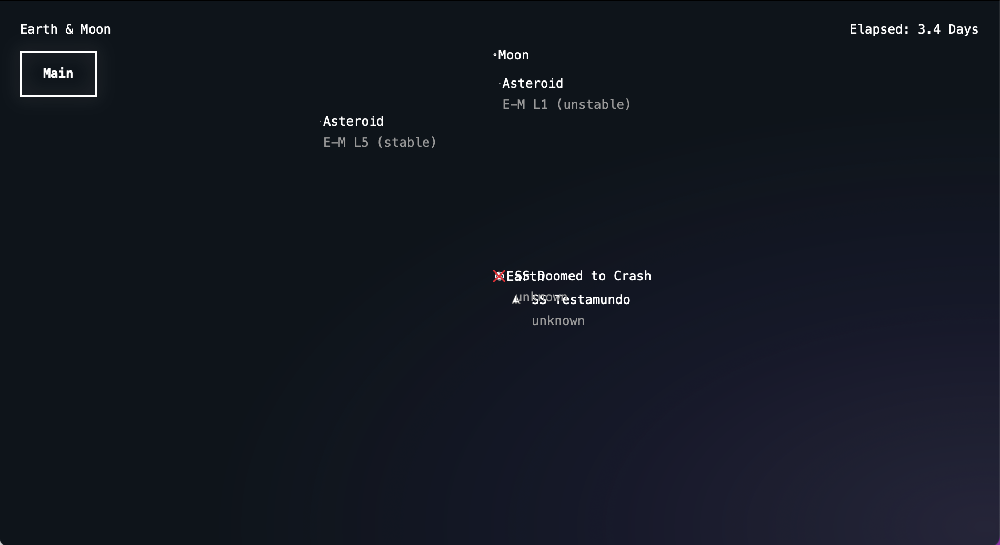
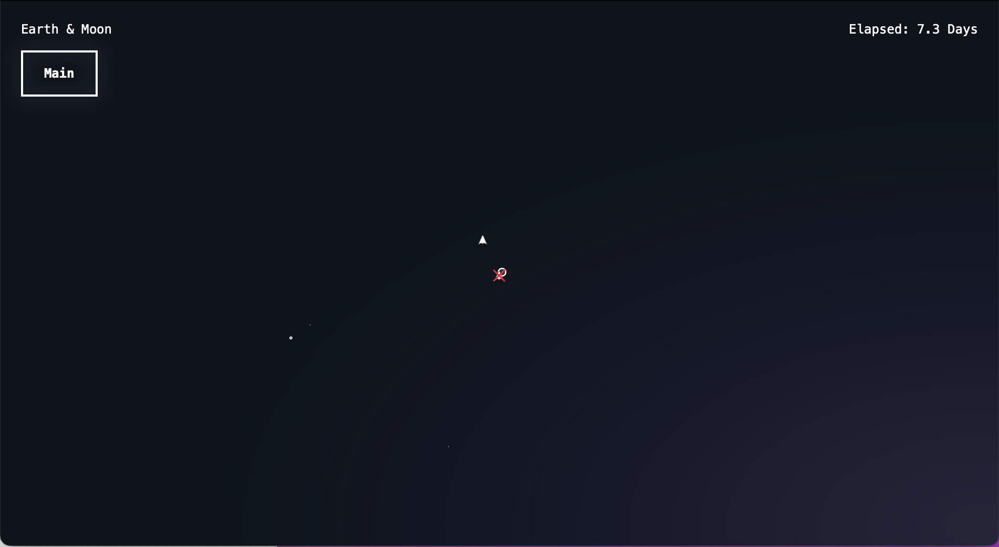

# October

## Control improvements

Added the ability to toggle on/off the labels :)

| With Labels                               | Without Labels                                  |
| ----------------------------------------- | ----------------------------------------------- |
|  |  |

Added play/pause via spacebar

## Simple AI training/tests to run

### Face the planet

Basically given a planet (or set of planets),

Adjust the ship's rotational velocity so that it's continually facing towards or away from the planet

- ship has to be able to:
  - change it's rotation via thrust
  - determine which body it's orbiting
  - determine which way to rotate itself
  - decide when to start/stop rotating

^ This test might take all month just to put together. The thrust/rotation changing are basic mechanics of the simulation that I need to do anyway, but the decision-making logic of the ship is there the trickery will come in. Maybe that's where the first little AI scripting will have to take place?

## Bugs/tweaks

Discovered a bug where the days appear to be counting at roughly half-speed. Weird?

Added debug view for angular velocity
