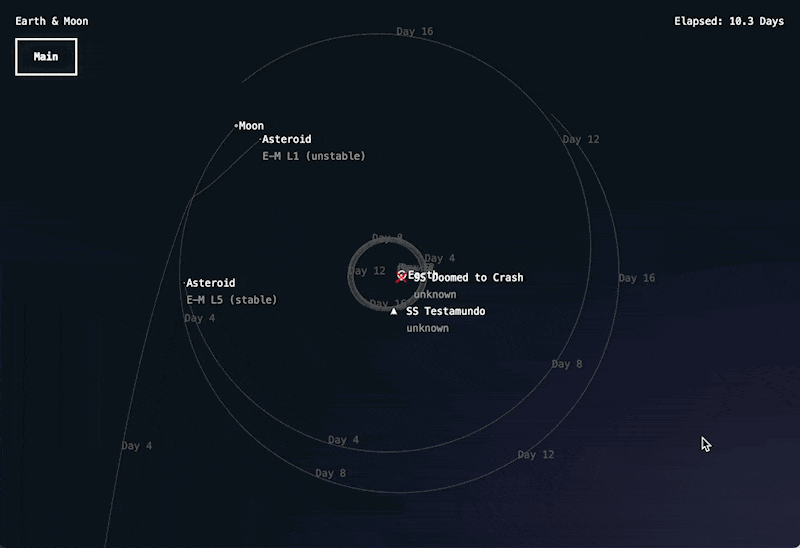

# January

Path forward, goals for a hackathon day:

- create a play/pause state switch
- pause triggers the path prediction
- phase 2 of pause allows a user to set burns and course corrections
- phase 2 depends on introducing thrust to ships

If nothing else, that would give us a functional ship orbit/flight-path playground to mess around with

Lord-willing, this year I won't get sidelined by Jury Duty taking over the hackathon days. Please Lord.

## Real-Time Path Prediction

Path prediction is going to have to be running constantly if the AI opponents/ships are going to be able to make their own decisions, so it's necessary to figure out a way to demo paths real-time.

For the user these won't be quite as useful with some of the chaotic results that can happen when the simulation's margin of error increases, like with the unstable L1 asteroid above.

Added controls:

| Key           | Action                                                                |
| ------------- | --------------------------------------------------------------------- |
| p             | Toggle path visibility (also toggles pathing, makes it compute heavy) |
| SHIFT +/-     | Increase/Decrease Prediction Accuracy                                 |
| SHIFT up/down | Increase/Decrease Prediction Distance/Time                            |

Both of these settings have large-ish performance impact, these would be good candidates to eventually move into a user-settings object where they could be set with a slider or something isntead of keys.

Also Pausing now turns on path visibility.

## Next Up

### Burns

The next step towards getting something actually interactive is giving the player the ability to execute course corrections to a ship.

This means having to create thrust and giving ships the ability to course-correct.

Hopefully that won't be too crazy, but we'll see :)

Practical steps:
* give user the ability to select individual ships or paths by clicking on (or really, within X pixels of) them.
* When selected, highlight that object's path. Make sure there's a different highlight for ships (which the user can interact with) and planets.
* user should be able to click and drag from a certain point on a path to indicate a burn starting there.
* somehow, user should be able to indicate how long and how intense the burn should be (maybe same thing for our purposes, since we're already measuring the mechanics in days and hours, it's not like they're scheduling down ot the minute).
* create an animation or indicator of some kind that a ship is thrusting when the game resumes

### A Settings Panel

With the increasing number of knobs and dials to tinker with, it probably makes sense to move a lot of these things that are currently bound to weird meta+key combos to an actual settings page, with inputs and sliders and such.
