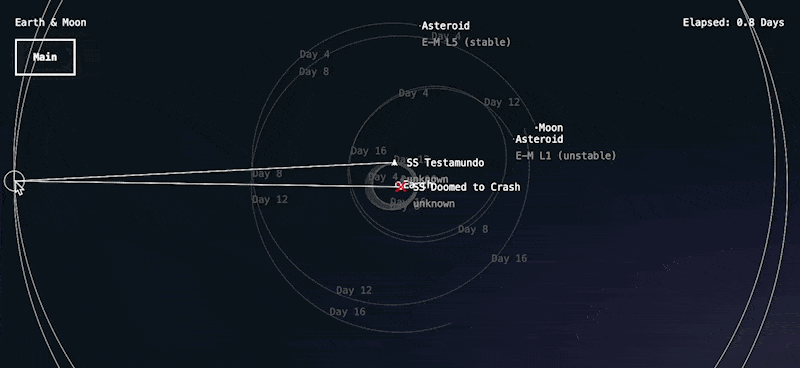

# July

The vast distances of space are nothing compared to the vast gaps in my free time to actually play with this project :)

Recent re-orgs at work though hopefully mean I'll have some time again! Lord please grant me some time to dedicate to this tinkering.

## Initiating a burn

Significantly more complex than one would think, partly just because I've been away from this so long & getting back into it means re-learning how all the coordinate systems work.

A little drawing though & we can at least define a vector based on the mouse's position from a given ship's coordinates, like so:

Several steps from here to actually plot a burn:

1. Convert vector in the view into game coordinates
2. Fix selection interface to allow for single-click ship selection or box-dragging selection (or maybe just shift-click, the box-dragging thing is neat but not really useful)
3. Find a logical/reasonable conversion from the burn vector into actual acceleration over time for the ship to execute
4. As the player moves their mouse, update the predicted path to show how the burn will affect the ship's trajectory