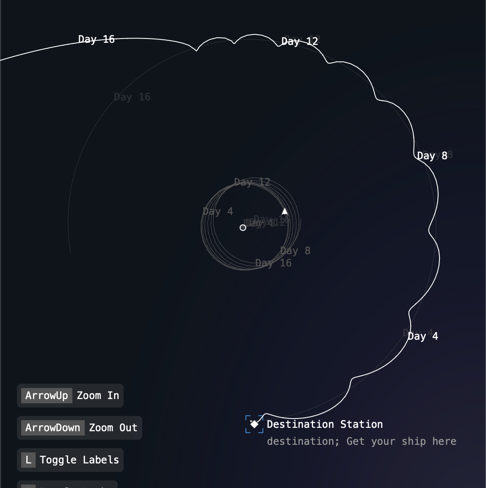

# September

Sept 1st:

A few more days have passed since the first test flight and disastrous end.

The peoples rallied and created a better flight path control.

The forces applied to the two test ships still liquified their respective crews instantly, however progress was made!

## Next up

Lots of little improvements to make now.

Now that interaction is possible it's obvious that it's not super obvious what's going on. My wife saw how it behaved & game me a blank look like it didn't make any sense :sniff:

### Pathing

The day markers on the predicted paths aren't terribly useful. We should offset those by the days currently past, so that instead of always moving further out along the predicted path to show how many days in the future they are, they show on which T+ day from mission start. That way they stay relatively put, and it lends a feeling of progress being made, even if nothing exciting is happening at the moment.

Also, the pathing currently has a discrepancy because we're assigning the first point along the predicted path to the ship + gravity before applying thrust, so every time the player sets a path it changes a little bit between what they intended to set and what actually got committed to the ship.

### Visuals

Couple improvements already made:

- When labels are turned off, the label of a selected ship will still display. This makes it much cleaner to play. Maybe this can be enhanced by showing labels for the target/destination object (or something)
- Start the game paused. This puts the player in control from T+0, allowing themself to get oriented before being immediately thrown into a puszzle. Portal does this masterfully by creating safe stopping points all over each level so the user can stop and re-orient after making some crazy series of jumps across the map. With space, everything is always in motion, so the only way this can happen is to literally pause the sim.

Up & coming:

- Smoother paths. Right now paths are really janky when objects fly close & make tight maneuvers. A better algorithm would be to check for large changes relative to other object's positions (like if it makes more than an equalateral triangle) and split that step into two half-steps, recursively. That way we could handle very tight manuevers without losing the essential calculations to avoid errant crashes/expulsions.
- Re-designed buttons. Homeworld 3's UI almost made me cry. Will do.
- Show available hotkeys for situationally relevant actions, like `[p]` for Plan Thrust, so that the user doesn't just get thrown into thrust-planning mode on every selection. These should also be clickable/tappable for users on touch devices w/o a keyboard.
- Should generally handle touch interactions. It would be realy cool to test out the game on a phone or tablet to show to people that way.
- `[Esc]` shoudl de-select a ship without committing the planned thrust. Actions should be cancellable.
- `[Tab]` should cycle through the available objects within a system, at least the ones on screen, maybe even off screen, like if a ship goes long and the player focuses on it, it becomes one of the focal points and the camera snaps out to the wider frame of view.
- Re-designed backgrounds, make it lighter gradients sometimes, maybe like a day/night cycle almost
- In the predicted path, it should predict when something is on a collision-course with something, showing the red X of death, and not showing any path past that point.

## Long-term/misc ideas

It would be really cool to be able to re-orient the camera and pathing to like the Earth-Moon axis frame of reference, that way someone could see the classic Apollo-mission view when planning burns. As it is, it's really hard to accurately interpret whether your ship is actually going to make it into a lunar orbit or not without that. And even currently, if I introduced the sun & the earth were orbiting that, it would be even harder to understand.

It would also be really cool to add a sort of "Arcade Mode" where you could just use the WASD/QE keys to rotate and fly the ship around all chaotic-style. That way people who didn't want as much of a strategy thing could still have fun & mess around.

Add a "Download" button? Maybe something to help get the PWA-ness to be more useful & make it more like a real app.

Smooth out the thrust commit, make 1g/day's worth of the thrust apply per day (or dt's worth applied each step of the path), instead of all at once, apply it like a realistic thrust over time. This'll make the change in path look a _LOT- more streamlined.

Add a high-contrast mode, where all the paths are clearly marked in different bright colors.

Get back to writing the AI for other ships & all the super fun game ideas from the start of the project, now that the basics are more or less all working.

Add a highlight to objects when the player moves the cursor close to them, like a pre-select similar to other RTS games.

Add the ability to plan multiple burns/thrusts over time. Like if the mouse cursor is somewhere out in time along the path, allow the user to select that point on the path and plan a thrust from there.

Add a path history, parallel to the predicted path. That way if someone wants, they could turn on the history, then let the simulation run for a long time, getting these cool geometric visualizations of the paths of the solar system.

It would also be amazing to experiment with procedural generation/procgen, eg. generate systems with N planets/starts/etc and randomized start/end goals.

### A better pathing algorithm

Long-term, the current pathing algo won't work. It's really rigid, only working at certain scales. If you were to plot a course to jupiter it would increase at O^n, increasing potentially massively as the size of the system increases. If you were to plot an orbit really close to the surface of a planet, the margin of error would be too large to consistently come out of it.

It would be better if the length of the step of each path was to some extent determined by the scale of the distance between the path and the objects affecting it, but it's also to do with the relative angle around each object. Like as you get closer to the earth, you could have a single step that skips right past the planet instead of calculating the exact curve.

So maybe it makes senes to check if a path changes the absolute angle between the ship and each planet by more than X degrees, and if so, cut that step in half and recompute. The downside is that we'd have to start with some arbitrary step size, which doesn't help with larger scales, and then we'd have variable delta-time again, which introduces it's own challenges.

Not sure what the best approach here is, but I know _something_ is needed.

## Make an objective

Sept 5-15th:

Barring everything else, the real next step is to figure out how a person could go from the game start state to "winning". There's not really enough content for this to be open world, although maybe that could be a variant, like just "free play" or something.

### Perspective

It seems like just achieving orbit around another body could be a challenging enough objective to start out, especially since everything is currently displaying absolute positions, which means that an orbit doesn't look like the classic circle that we all know and love, but like that crazy gear-tooth pattern as the ship slows and speeds on the in-and-out sides of the moon's orbit. This would be even more of an issue if the earth was orbiting around the sun in the Earth-Moon level instead of acting like a fixed point.

To really understand achieving an orbit we'd need to lock the camera's perspective to the moon/destination and treat it's position like a fixed point for all the path prediction.

Maybe this means we need to rotate and scale the coordinates to the Earth-Moon axis so that those two are always in the same position, and the paths wind up circling around them like the classic diagrams of the Apollo missions.

If this were the case, we'd then run into another challenge which is that perspective of real motion & physics is totally lost, because planets are currently just rendered as white circles. We'd need to include a lighting system, which would be awesome anyway, so that the Earth and Moon were lit from some external point, like the Sun, so that when the perspective is locked to the two you'd see the light slowly rotate over the lunar cycle to help give this perception of motion. I'm getting a little motion sick just imagining it, so maybe it's a bad idea, but we need _something_.

### A goal

If the goal is as simple as to achieve a stable orbit, there are several practical challenges to overcome:

In game terms, a stable orbit is really tricky, because it doesn't follow any specific shape. Just determining orbital period is tricky when the ship is flying around and constantly changing what it's orbital path looks like.

Classically, a stable orbit around a single object would be an elipse. Also it could be staying within the space of one of the stable lagrange points, or technically even a horshoe orbit.

The paths we currently get might be an approximation of an elipse when stable, but how can we compare them?

We could define some arbitrary margin of error or safe-zone in which we call the orbit stable, and so long as the path stays within that green circle we call it good enough. That would get us to having "something achievable", even if it's not really representative.

Originally I was thinking about having ships take off and land, but the planets are spinning so fast (or at least could be) relative to absolute space that it would be really difficult to process visually. Going from orbit to orbit is a lot simpler, and if we're thinking about realistic cases, large asteroid mining vessels wouldn't necessarily land anyway, they'd dock with space stations to offload cargo, while crew & supplies used smaller shuttles & such to get up and down.

Maybe the target is a "station" orbiting the Moon/target object, The goal is to match that station's orbit so you could dock with it, which requires getting into a very specificly-shaped orbit around a body. Then we could define the margin-of-error in human-scale units, like even a hundred kilometers to be generous. And then the shape of the orbit becomes a part of the game.

Then we have to conquer the realistic challenge of going from high-energy orbits to low-energy orbits, the challenges with speeding up/slowing down, etc.

However it also introduces additional computation as we have to start comparing the predicted paths every frame of multiple objects (which maybe isn't that bad, after all we're porentially predicting dozens of objects' paths every frame anyway).

#### Station Ideas

1. Create a "non-player ship" class
2. Use that to represent stations

On the starter (Earth + Ship + Station), have the player ship orbiting at a lower/faster orbit than the station, so that the player's goal is simply to ascend to a higher orbit & grasp the basic physics

On the Earth-Moon, have the station orbiting the moon & the player's ship orbiting the earth, making the player navigate ascending, but also switching between zones of influence & getting from the orbit of one body to another

On the Saturn, have the station orbiting somewhere close to the rings & the player maybe in a wide orbit out by Titan or something, making them now descend without getting caught in all the messy gravity wells :)

Other levels could include a station at a lagrange point, doing some kind of station-keeping, etc.

Once getting "close" to the target's speed and position (how close? no idea) then end the mission with a victory screen.

Boom, first gameplay loop :)

From there we could expand to include ai-controlled non-player ships that the player has to catch. Or introduce any of the various limitation mechanics for the player to work against like not running out of fuel, or a simple time-limit.

### Ship Names

I don't know why it didn't occur to me earlier, but if the player is going to be controlling a ship, they should at least get to name it. "SS Testamundo" shall soon be `{playerShipName}` with a setting / min-character creation screen where the player just gets to name their ship & maybe determine what type it is :)

### A little progress.

Sept 15th:

After adding stations and cleaning up the Earth and Earth/Moon levels it's clear that the pathing and controls are a lot worse than I thought they were.

Shortly after this was taken my ship crashed straight into the moon.

The orbits we can calculate accurately are all at 1-200 times the ranges that the actual orbits of the ISS and Apollo missions use for the Earth and Moon respectively.

Also challenging is still just communicating what's going on to the player. The scale makes it really tricky to understand how far from the moon you are, what the main source of gravity is with respect to the ship, how fast you're going, all of it.

I was however able to get the ship to roughly match the orbit of a station around the earth by itself.

Also a big issue is that if I remove the earth and moon as focal points, thrust control goes haywire. Most likely it's because I'm mapping the center of the viewport to the center of the simulation, so the coordinates don't match up at all if those two center points don't align.

More to do. I'm leaving Saturn be for tonight. :)
