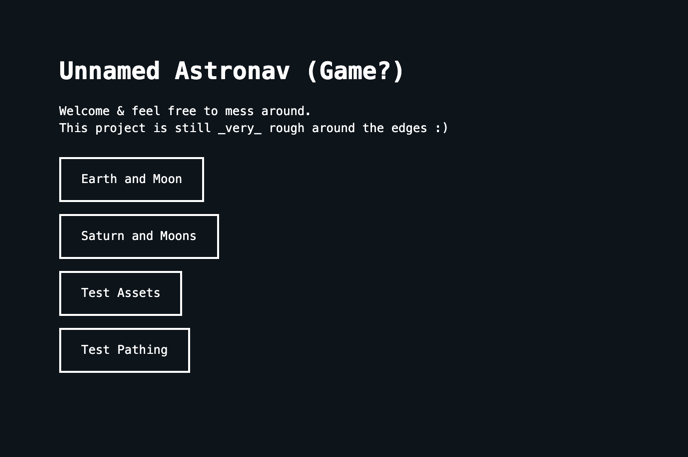
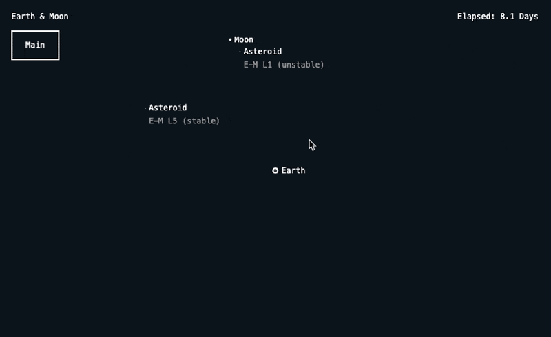

# February

Starting to consolidate these journals into larger increments, now that I'm coming back to this project after the holidays.

## Hackathon

Hackathon ideas, 2 days to just work on this:

Backend mechanics

- generate systems instead of hard coding
- save systems/game state in local storage
- ability to share/favorite/spotlight generated systems?

In-game mechanics

- Ship transit, make something that moves
- test possible interfaces for controlling the ship
- one direct control, like keyboard interface
- one slingshot-style interface, define a direction and a burn time/power
- one remote control, order ship to a point or object & let ai figure out the rest
- maybe define a hyperspace mechanic (exponential acceleration like the high school novel concept)
- maybe zoom in/out and select focal points somehow, save focal points and zoom level to keys on the keyboard (like views 1,2,3)
- test control schemes, selecting ships, keyboard inputs, play/pause

Design stuff

- figure out a way to visualize the flow of gravity around the space
- make some fancy space-themed buttons!
- make some cool ship designs (Figma or code?)
- finally make asteroid designs (Figma or code?)

## In-Game Controls

This is a pattern that isn't 100% original, but I'm really happy with how it's coming along:

```js
// TODO:
// 1. Fgure out why these need to be wrapped in an inline function?
// 2. Convert controls map into it's own global that can be rendered on a page

const controlsMap = {
  ArrowUp: {
    name: 'Zoom In',
    action: () => view.zoomIn(),
  },
  ArrowDown: {
    name: 'Zoom Out',
    action: () => view.zoomOut(),
  },
};

const metaControlsMap = {
  f: {
    name: 'Fullscreen',
    action: () => view.fullscreen(),
  },
};

window.addEventListener('keyup', (e) => {
  if (controlsMap[e.key]) {
    controlsMap[e.key].action();
  }

  // Handle metakeys & additional controls
  if (e.ctrlKey || e.metaKey) {
    if (metaControlsMap[e.key]) {
      metaControlsMap[e.key].action();
    }
  }
});
```

Basically what this does is consolidate all the keyboard controls for a specific game mode into a single object with human readable names. Why does this matter? It becomes a single source of truth for the particular game-mode's functionality, and for building out a controls page, where users can see a list of all the available controls and what they do.

Potentially this could be expanded into customization options even, if we ever get that far.

It feels so stinkin nice to have some kind of input capability now as well. Previously the orbital simulation was read-only. You could load up a system, but then just watch & that's kind of boring.

## UI Design

Also saving this beaut, my first-ish crack at the most basic visual styles :)

Main Screen:



RTS-Style Object Selection:


